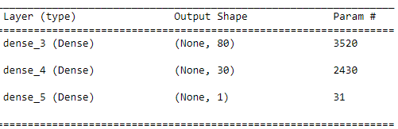
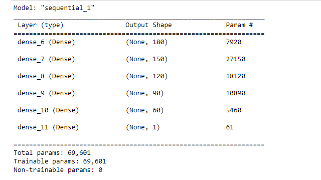
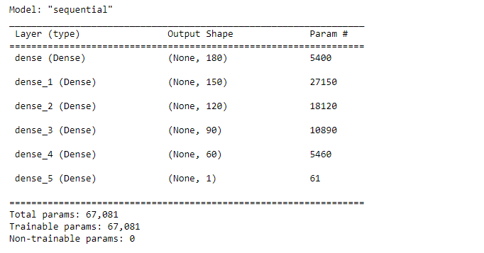
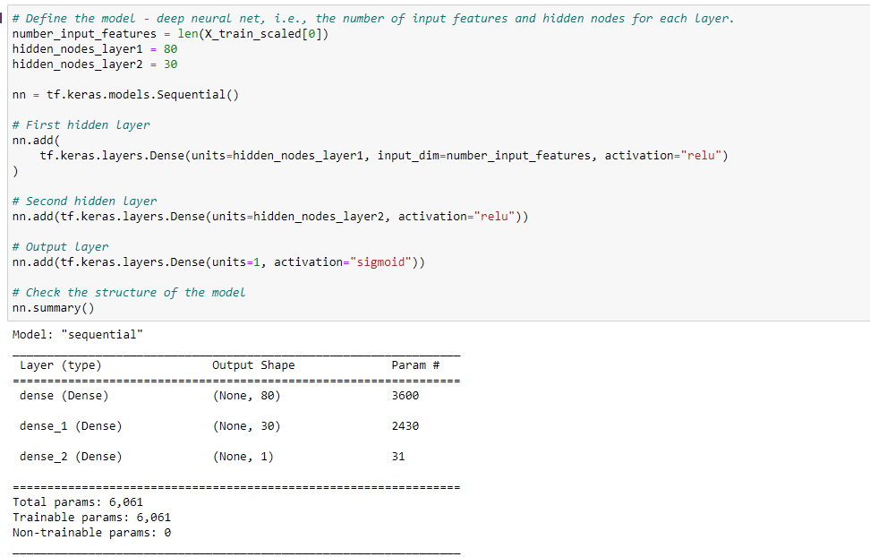

# Neural_Network_Charity_Analysis

## Overview of the analysis
Working with application status for businesses Alphabet Soup's works with and using a neural network, I am trying to see if I can predict whether a project funded by Alphabet Soup will be successful based on previous data.

## Notes
EIN and NAME—Identification columns
APPLICATION_TYPE—Alphabet Soup application type
AFFILIATION—Affiliated sector of industry
CLASSIFICATION—Government organization classification
USE_CASE—Use case for funding
ORGANIZATION—Organization type
STATUS—Active status
INCOME_AMT—Income classification
SPECIAL_CONSIDERATIONS—Special consideration for application
ASK_AMT—Funding amount requested
IS_SUCCESSFUL—Was the money used effectively

## Results
### Data Preprocessing
- What variable(s) are considered the target(s) for your model?
    The target is whether the loan application led to success.
- What variable(s) are considered to be the features for your model?
    - Application Type
    - Affiliation
    - Classification
    - Use Case
    - Organization
    - Income Amount
    - Specification considerations.
- What variable(s) are neither targets nor features, and should be removed from the input data?
    - Name of business
    - EIN which are identification numbers
    - Organization might not be as important.
    - Affilations might not be as important.
### Compiling, Training, and Evaluating the Model
- How many neurons, layers, and activation functions did you select for your neural network model, and why?

 
*Original*
 
*Optimized1*
 
*Optimized2*
 
*Optimized3*
 
*Optimized4*
                           	|

- Were you able to achieve the target model performance?
    No, unfortunately I was unable to find the best model that was at 75 Percent or higher. The closest I was able to get was with the last optimized model (Optimized4)
- What steps did you take to try and increase model performance?

| Model         	| Loss   	| Accuracy 	| Changes                                                                                                                            	|
|---------------	|--------	|----------	|------------------------------------------------------------------------------------------------------------------------------------	|
| Original (D2) 	| 0.5558 	| 0.7254   	| N/A                                                                                                                                	|
| Optimized1    	| 0.5560 	| 0.7254   	| Adding 3 additional layers, with more nodes as well and different activations.                                                     	|
| Optimized2    	| 0.5677 	| 0.7193   	| Converted incomes to maximum value for calculation; used income to asking loan ratio and dropping asking and income values on top of additional layers from Optimized 1. 	|
| Optimized3    	| 0.5663 	| 0.7234   	| Filtered those out with less value_counts than 1000 for affiliation along with layers similar to Optimized 1.                      	|
| Optimized4    	| 0.5557 	| 0.7256   	| Removed applications that had value_counts of less than 100. Also used value_counts of class with 1000 instead of 1800. Kept Original neurons. 

## Summmary
There is more work to be done to find the best model using the right variables. I could use the alternative data, change bins for the different variables. I could add more hidden layers and change the activation nodes around to find the best version. 

Changing bins, removing data, using alternative calculations, and changing the number of layers, I could not obtain an accuracy of over 75 with the methods I used. 
It would take a lot more modification to figure out the best neural network to accurately predict whether a business will be successful on a project that Alphabet Soup finances.